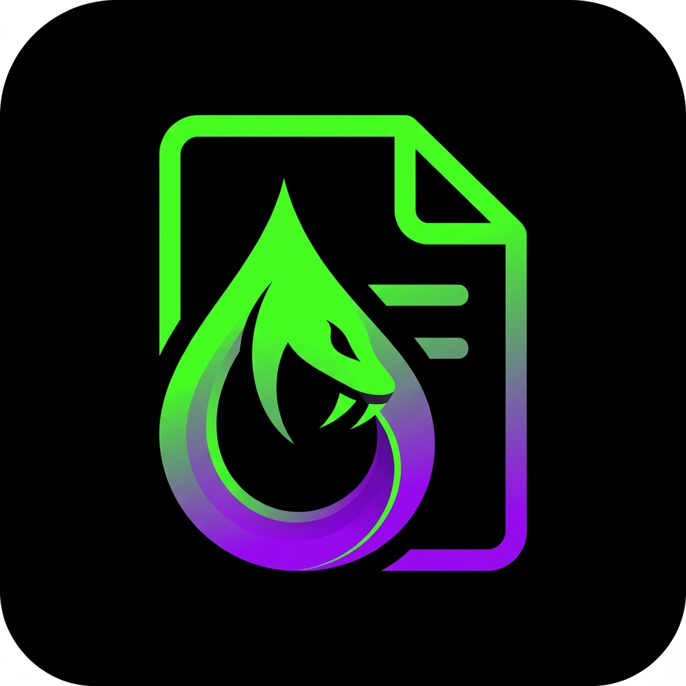
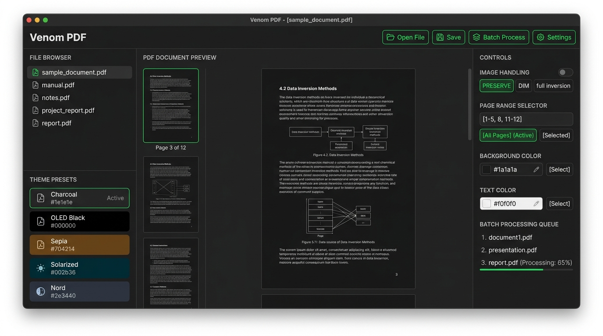

<p align="center">
  
</p>

<h1 align="center">🐍 Venom PDF</h1>

<p align="center">
  <b>Smart PDF Dark Mode Converter — Blazing Fast, Fully Offline, Zero Compromises</b>
</p>

<p align="center">
  
  
  
  
  
</p>

<p align="center">
  
</p>

---

## 🎯 What is Venom PDF?

**Venom PDF** is a native desktop application that intelligently converts PDF documents to dark mode — without destroying text quality, searchability, or image integrity.

Unlike every other tool on the market, Venom PDF operates directly on the PDF's vector content streams. Your text stays sharp, selectable, and searchable. Your images stay untouched. Your privacy stays intact.

> **Think of it as "dark mode that actually works" for any PDF, on any device.**

---

## 🔥 Why Venom PDF Exists

Every existing PDF dark mode solution is broken in at least one critical way:

| Problem | Who Does It | What Breaks |
|---------|-------------|-------------|
| **Rasterization Trap** | Online converters (PDF2Go, ConvertIO) | Text becomes blurry images. 2 MB file → 60 MB bloat. No searchability. |
| **Naïve RGB Negation** | Basic CLI tools, browser extensions | Photos become creepy negatives. Charts turn into eye-burning glare. |
| **View-Only Lock-in** | Adobe, SumatraPDF, Okular | Can't export. Dark mode disappears when you share the file. |
| **Privacy Violation** | Online converters | Your confidential documents uploaded to unknown servers. |
| **Halation / Eye Strain** | Pure black (#000) tools | Stark white-on-black causes glow/blur for users with astigmatism. |

**Venom PDF solves all five.**

---

## ✨ Key Features

### 🧠 Smart Vector Preservation
Inverts PDF content streams directly — text stays **razor-sharp, selectable, and searchable**. No rasterization. No file bloat. A 2 MB PDF stays ~2 MB.

### 🖼️ Intelligent Image Handling
Automatically detects raster images, photos, and charts. Choose how to handle them:

| Mode | Behavior |
|------|----------|
| **Preserve** *(default)* | Images stay completely untouched — original colors intact |
| **Dim** | Slight brightness/contrast reduction so images don't blind you in dark mode |
| **Full Invert** | Traditional RGB negation (for diagrams/line art that benefits from it) |

### 🎨 Curated Dark Themes
Not just "invert colors" — scientifically-designed reading themes:

| Theme | Background | Text | Best For |
|-------|-----------|------|----------|
| **Charcoal** | `#1e1e1e` | `#d4d4d4` | Extended reading (VS Code style) |
| **OLED Black** | `#000000` | `#ffffff` | Battery saving on tablets/phones |
| **Sepia** | `#704214` | `#f0e6d3` | Warm, paper-like comfort |
| **Solarized** | `#002b36` | `#839496` | Developer-friendly, low contrast |
| **Nord** | `#2e3440` | `#d8dee9` | Soft Scandinavian palette |
| **Custom** | *You pick* | *You pick* | Full control with color pickers |

### 📄 Selective Page Inversion
Invert only the pages you need:
- **All Pages** — one-click full document conversion
- **Page Ranges** — `1-5, 8, 11-12` syntax
- **Exclude Pages** — keep cover pages, photo appendices in original colors

### ⚡ Batch Processing
Drop an entire folder of PDFs and process them all at once. Multi-threaded Rust backend handles 500+ page textbooks without breaking a sweat.

### 🔒 100% Offline & Private
Zero network traffic. No telemetry. No file uploads. Your documents never leave your machine. Period.

### 🖱️ Windows Context Menu Integration
Right-click any PDF in Windows Explorer → **"Invert with Venom PDF"**. No need to open the app first.

---

## 🏗️ Tech Stack

| Layer | Technology | Why |
|-------|-----------|-----|
| **Runtime** | [Tauri 2.0](https://tauri.app) | Tiny binary (~15 MB), native performance, cross-platform |
| **Backend** | Rust | Memory-safe, blazing fast, multi-threaded PDF processing |
| **PDF Engine** | `lopdf` + `pdf_oxide` | Pure Rust — low-level content stream manipulation + text extraction |
| **Frontend** | React + TypeScript + Tailwind CSS | Modern, responsive UI with VS Code-level polish |
| **PDF Viewer** | `pdf.js` | Industry-standard in-browser PDF rendering |
| **Bundler** | Vite | Lightning-fast HMR during development |

---

## 📦 Installation

### Windows
Download the latest `.msi` installer from [Releases](https://github.com/yourusername/venom-pdf/releases).

### macOS
```bash
brew install --cask venom-pdf    # Coming soon
```

### Linux
```bash
# AppImage (universal)
chmod +x VenomPDF-*.AppImage && ./VenomPDF-*.AppImage

# Debian/Ubuntu
sudo dpkg -i venom-pdf_*.deb
```

### Build from Source
```bash
# Prerequisites: Rust 1.75+, Node.js 20+, pnpm
git clone https://github.com/yourusername/venom-pdf.git
cd venom-pdf
pnpm install
pnpm tauri build
```

---

## 🚀 Quick Start

```
1. Open Venom PDF
2. Drag & drop a PDF (or click "Open File")
3. Pick a theme (or customize colors)
4. Choose image handling mode
5. Click "Convert" → Done. Dark mode PDF saved.
```

---

## 🗺️ Roadmap

- [x] Project planning & architecture design
- [ ] **v0.1** — Core PDF inversion engine (Rust backend)
- [ ] **v0.2** — Theme presets + custom color pickers
- [ ] **v0.3** — Image detection & selective handling
- [ ] **v0.4** — Batch processing + progress tracking
- [ ] **v0.5** — Page range selection UI
- [ ] **v0.6** — Windows context menu integration
- [ ] **v0.7** — PDF preview with live theme switching
- [ ] **v1.0** — Production release with installer

---

## 🤝 Contributing

Contributions welcome! See [CONTRIBUTING.md](docs/CONTRIBUTING.md) for guidelines.

```bash
# Development mode with hot reload
pnpm tauri dev
```

---

## 📄 License

MIT License — see [LICENSE](LICENSE) for details.

---

<p align="center">
  <b>Built with 🐍 venom and ❤️ for your eyes.</b>
</p>
